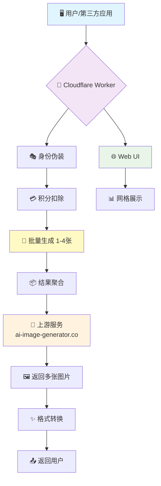
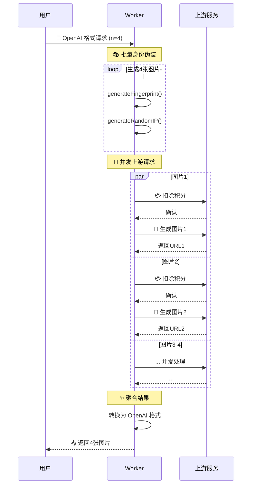

# 🎨 AI Generator Flux Pure (v2.5.0)

<div align="center">


**极简纯粹的 AI 绘画 API 转换器 · 支持多张图片生成 · 单文件部署奇迹**

> 🧠 **哲学思考**: 在这个代码即思想的时代，我们不仅是程序员，更是思想的建筑师。这个项目是一次减法的艺术实践——剥离繁杂，回归核心，让你与 AI 创造力之间，只隔一个 API 的距离。

[](https://deploy.workers.cloudflare.com/?url=https://github.com/kinai9661/ai-generator-2api-cfwork)
[](https://github.com/kinai9661/ai-generator-2api-cfwork/blob/main/TESTING.md)

</div>

---

## ✨ 核心特性

<div align="center">

| 🚀 极致性能 | 🎯 精准专注 | 🔧 智能调试 | 🖼️ 多图生成 |
|:---:|:---:|:---:|:---:|
| **单文件架构**<br>极致精简，高效运行 | **专为 Flux**<br>深度优化，最佳体验 | **透明日志**<br>完整追踪，轻松排查 | **批量处理**<br>同时生成1-4张 |

</div>

### 🎨 功能亮点

- **🚀 纯粹体验**: 专注文生图，移除所有冗余功能，性能最大化
- **🎯 模型锁定**: 专为 `flux-schnell` 深度优化，无需选择困难
- **🖼️ 多图生成**: 支持同时生成 1-4 张图片，并发处理提升效率 ⭐ **NEW**
- **🔍 深度透视**: 全新开发者驾驶舱，实时监控请求全链路
- **⚡️ 一键部署**: Cloudflare Workers 零配置部署，5分钟上线
- **💸 成本优化**: 智能利用上游服务，实现近乎零成本 AI 绘画

---

## 🏛️ 架构总览

<div align="center">



</div>

---

## 🚀 快速开始

### 方案一：一键部署（推荐）

<div align="center">

[](https://deploy.workers.cloudflare.com/?url=https://github.com/kinai9661/ai-generator-2api-cfwork)

</div>

**部署步骤:**

1. **点击上方按钮** → 登录 Cloudflare 账户
2. **项目命名** → 例如 `my-ai-painter`
3. **配置环境变量**:
   - 进入 Worker 设置 → 变量
   - 添加 `API_MASTER_KEY` (你的访问密钥)
   - **重要**: 点击 🔒 加密按钮
4. **保存部署** → 完成！🎉

你的 API 地址: `https://my-ai-painter.your-subdomain.workers.dev`

### 方案二：手动部署

```bash
# 克隆项目
git clone https://github.com/kinai9661/ai-generator-2api-cfwork.git
cd ai-generator-2api-cfwork

# 安装 Wrangler CLI
npm install -g wrangler

# 登录 Cloudflare
wrangler login

# 创建 wrangler.toml
cat > wrangler.toml << EOF
name = "ai-generator-2api"
main = "worker.js"
compatibility_date = "2025-11-28"

[vars]
API_MASTER_KEY = "your-secret-key-here"
EOF

# 部署项目
wrangler deploy
```

---

## 🎮 使用指南

### 1. 🌐 开发者驾驶舱（Web UI）

直接访问你的 Worker 地址体验完整功能：

```
https://你的项目名.你的子域名.workers.dev
```

**功能特色:**
- 🏛️ **实时参数调整** - 提示词、图片比例、生成数量一键配置
- 👁️ **请求透明化** - 完整追踪从伪装到生成的每一步
- 🎨 **网格展示** - 多张图片以网格形式实时展示 ⭐ **NEW**
- 📝 **智能日志** - 详细调试信息，问题定位无忧

**使用示例:**

1. 选择生成数量（1-4张）
2. 选择图片比例（1:1, 16:9, 9:16, 4:3, 3:4）
3. 输入提示词：`futuristic city with neon lights, cyberpunk style`
4. 点击 **🚀 开始生成**
5. 查看多张图片网格展示

### 2. 🤖 对接第三方应用

#### ChatGPT-Next-Web 配置

```yaml
# 配置示例
接口地址: https://你的项目名.你的子域名.workers.dev/v1
API密钥: 你在环境变量中设置的 API_MASTER_KEY
模型选择: flux-schnell
```

#### API 调用示例

**生成单张图片:**
```bash
curl -X POST https://your-worker.workers.dev/v1/images/generations \
  -H "Authorization: Bearer YOUR_API_KEY" \
  -H "Content-Type: application/json" \
  -d '{
    "prompt": "a cute cat wearing sunglasses",
    "n": 1,
    "size": "1024x1024"
  }'
```

**生成多张图片 (NEW):**
```bash
curl -X POST https://your-worker.workers.dev/v1/chat/completions \
  -H "Authorization: Bearer YOUR_API_KEY" \
  -H "Content-Type: application/json" \
  -d '{
    "model": "flux-schnell",
    "messages": [{"role": "user", "content": "astronaut in space"}],
    "n": 4,
    "aspect_ratio": "16:9",
    "stream": false
  }'
```

---

## 🔧 技术深度解析

### 核心架构流程



### 🧩 核心模块详解

| 模块 | 技术实现 | 难度 | 功能描述 |
|------|----------|------|----------|
| **🎭 身份伪造** | `generateFingerprint()`<br>`generateRandomIP()` | ⭐⭐☆ | 模拟真实用户指纹和IP地址，绕过基础风控 |
| **🔄 批量生成** | `performBatchGeneration()` | ⭐⭐⭐ | 并发处理多张图片，智能容错机制 |
| **💳 积分管理** | `/api/credits/deduct` | ⭐☆☆ | 预扣积分机制，确保服务可用性 |
| **🎨 图像生成** | `FormData` + Multipart | ⭐⭐☆ | 构造上游服务所需的表单数据格式 |
| **📊 日志系统** | `Logger` 类 + 实时流 | ⭐⭐⭐ | 面向对象日志记录，支持实时调试展示 |
| **🔄 流式响应** | `TransformStream` API | ⭐⭐⭐⭐ | 实现类ChatGPT的流式输出体验 |

### 💻 代码结构

```
worker.js (v2.5.0)
├── 🏛️ 核心配置 (CONFIG)
│   ├── MAX_IMAGES = 4              # 最大图片数量
│   ├── DEFAULT_NUM_IMAGES = 1      # 默认生成数量
│   └── 模型参数预设
├── 🔀 请求路由 (fetch)
│   ├── CORS 预处理
│   ├── Web UI 路由
│   └── API 端点分发
├── 🎯 业务逻辑
│   ├── Logger 类 📝
│   ├── performBatchGeneration 🚀         # NEW: 批量生成
│   ├── performUpstreamGeneration 🎨
│   ├── handleChatCompletions 💬          # 支持 n 参数
│   └── handleImageGenerations 🖼️         # 支持 n 参数
├── 🛠️ 工具函数
│   ├── 认证验证
│   ├── 错误处理
│   └── 响应构造
└── 🌐 Web 界面
    └── 网格式多图展示 UI              # NEW
```

---

## 🧪 测试指南

我们提供了完整的测试套件，确保功能正常运行。

### 快速测试

**使用 Python 脚本 (推荐):**
```bash
# 下载测试脚本
curl -O https://raw.githubusercontent.com/kinai9661/ai-generator-2api-cfwork/main/test-api.py

# 安装依赖
pip install requests

# 修改配置（编辑 WORKER_URL 和 API_KEY）
nano test-api.py

# 执行测试
python3 test-api.py
```

**使用 Bash 脚本 (Linux/Mac):**
```bash
# 下载并执行
wget https://raw.githubusercontent.com/kinai9661/ai-generator-2api-cfwork/main/test-api.sh
chmod +x test-api.sh
./test-api.sh
```

### 测试覆盖

- ✅ 单张图片生成 (1:1)
- ✅ 两张图片生成 (16:9)
- ✅ 三张图片生成 (9:16)
- ✅ 四张图片生成（最大值）
- ✅ Chat API 多图生成
- ✅ 超过最大值限制测试
- ✅ 不同比例测试
- ✅ 模型列表查询

**详细测试文档**: [TESTING.md](https://github.com/kinai9661/ai-generator-2api-cfwork/blob/main/TESTING.md)

---

## 🚀 进阶功能

### 🔐 安全配置

```javascript
// 环境变量配置示例
API_MASTER_KEY = "sk-your-secret-key-here"  // 访问密钥
MAX_IMAGES = 4                              // 最大图片数量
```

### 📊 监控指标

- ✅ 请求成功率监控
- ⏱️ 响应时间追踪  
- 🖼️ 生成图片数量统计
- 🔄 上游服务状态检查
- 💸 并发处理效率分析 ⭐ **NEW**

---

## 🛠️ 故障排除

### 常见问题解决方案

| 问题现象 | 可能原因 | 解决方案 |
|---------|----------|----------|
| 🚫 401 认证失败 | API密钥错误 | 检查环境变量 `API_MASTER_KEY` 配置 |
| 🐢 响应超时 | 上游服务延迟 | 调整超时设置或重试机制 |
| 💸 积分不足 | 上游额度耗尽 | 等待额度重置或更换账户 |
| 🔄 格式错误 | 请求格式不匹配 | 验证 OpenAI 兼容性设置 |
| 🖼️ 部分图片失败 | 上游不稳定 | 正常现象，成功的图片仍会返回 |

### 🔍 调试技巧

1. **使用开发者驾驶舱** - 实时查看完整请求链路
2. **检查网络日志** - 分析上游服务响应
3. **验证环境变量** - 确认配置正确性
4. **监控资源用量** - 确保 Worker 配额充足
5. **查看批量日志** - 追踪每张图片的生成状态 ⭐ **NEW**

---

## 🌟 项目演进路线

<div align="center">

| 版本 | 状态 | 核心特性 | 技术突破 |
|:---:|:---:|:---|:---|
| **v1.0** | ✅ 完成 | 基础 API 转发 | 概念验证 |
| **v2.0** | ✅ 完成 | 多模型支持 | 功能扩展 |
| **v2.4** | ✅ 完成 | Flux 纯净版 | 架构精简 |
| **v2.5** | 🎯 **当前** | **多图生成** | 并发处理 |
| **v3.0** | 🚧 规划 | 智能容错 + 动态配置 | 健壮性提升 |
| **v4.0** | 🌌 愿景 | 多源适配 + 插件化 | 生态扩展 |

</div>

### 🎯 未来规划

- **🔧 智能容错机制** - 上游异常自动恢复
- **📊 动态配置系统** - 热更新无需重新部署  
- **🌐 多源支持** - 适配更多 AI 绘画服务
- **🔌 插件化架构** - 模块化扩展能力
- **🎬 视频生成** - 支持文本转视频 (规划中)

---

## 🤝 贡献指南

我们欢迎所有形式的贡献！无论是代码改进、文档完善，还是创意想法。

### 💡 如何参与

1. **Fork 项目** - 创建你的个人副本
2. **功能开发** - 实现新功能或修复问题
3. **测试验证** - 确保代码质量
4. **提交 PR** - 分享你的改进

### 🎯 急需贡献

- 🔧 错误处理优化
- 📚 文档完善
- 🧪 测试用例编写
- 🌍 多语言支持
- 🎨 更多模型支持

> **开源精神**: 每一次贡献，无论大小，都在为技术社区增添价值。让我们一起构建更美好的开源生态！✨

---

## 📝 变更日志

### v2.5.0 (2025-11-28) ⭐ **最新**
- ✨ **新增**: 支持同时生成 1-4 张图片
- ⚡ **优化**: 并发请求处理，提升生成效率
- 🌐 **增强**: Web UI 网格式多图展示
- 📊 **改进**: 批量生成日志追踪
- 🛠️ **兼容**: 完全兼容 OpenAI API 的 `n` 参数

### v2.4.0 (2025-11-26)
- 🧹 **精简**: 移除所有图生图逻辑
- 🎯 **锁定**: 仅保留 flux-schnell 模型
- 🔍 **透视**: Web UI 日志增强

---

## 📝 许可证

本项目采用 **Apache License 2.0** 开源协议。

**你可以自由地:**
- ✅ 商业使用
- ✅ 修改代码  
- ✅ 分发副本
- ✅ 专利使用

**你需要:**
- 📝 保留版权声明
- 📝 声明代码变更

这是一个对商业友好的开源协议，鼓励广泛采用和创新。

---

## 📞 支持与联系

- 🐛 **问题反馈**: [GitHub Issues](https://github.com/kinai9661/ai-generator-2api-cfwork/issues)
- 📚 **使用文档**: [测试指南](https://github.com/kinai9661/ai-generator-2api-cfwork/blob/main/TESTING.md)
- 💬 **技术讨论**: [Discussions](https://github.com/kinai9661/ai-generator-2api-cfwork/discussions)

---

<div align="center">

## 🎉 开始创造吧！

**让代码指引你的创意，让 AI 赋能你的想象。**

[](https://deploy.workers.cloudflare.com/?url=https://github.com/kinai9661/ai-generator-2api-cfwork)

[](https://github.com/kinai9661/ai-generator-2api-cfwork/blob/main/TESTING.md)

*星辰大海，代码为舟，创意作帆。🚀*

---

**Made with ❤️ by AI Enthusiasts**

</div>