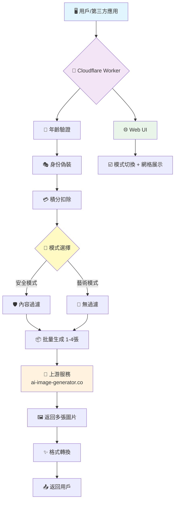
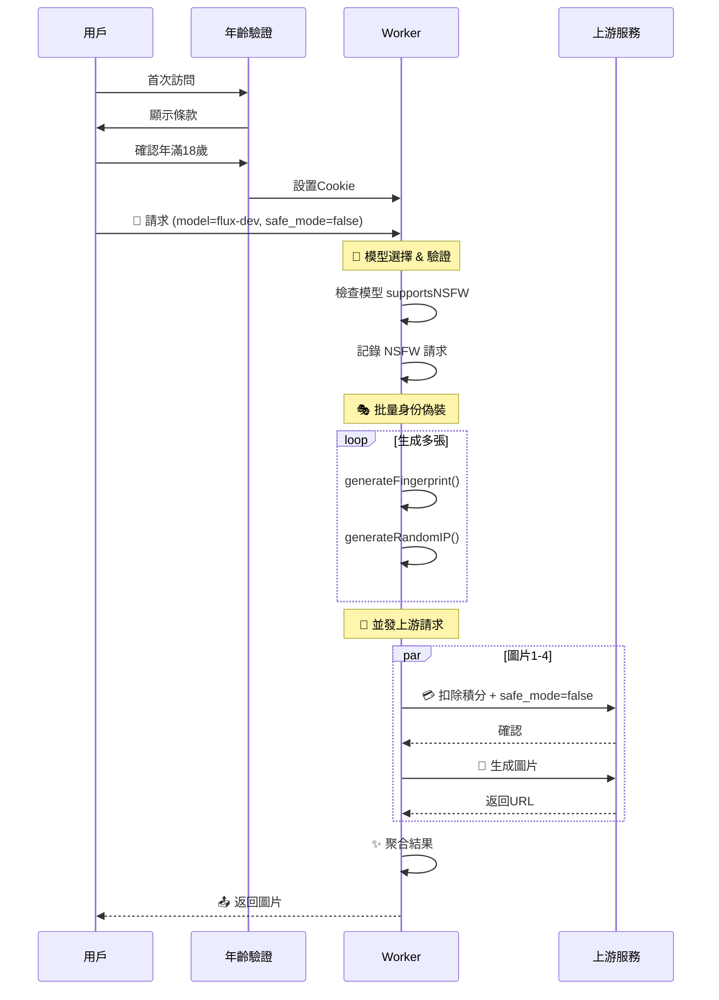

# 🎨 AI Generator Multi-Model (v2.7.0)

<div align="center">


**強大的多模型 AI 繪畫 API · 支持 Flux/SD/DALL-E · 藝術創作自由 · 安全可控**

> 🧠 **哲學思考**: 在AI百花齊放的時代,我們不僅是程序員,更是技術的集成大師。這個項目將多個世界頂級 AI 模型融合於一,在安全合規的前提下,為藝術創作者提供最大的自由度。

[](https://deploy.workers.cloudflare.com/?url=https://github.com/kinai9661/fluxai)
[](https://github.com/kinai9661/fluxai/blob/main/TESTING.md)

</div>

---

## ⚠️ 重要聲明

**本項目僅供合法的藝術創作使用。使用者必須:**
- ✅ 年滿 18 歲(或當地法定成年年齡)
- ✅ 遵守當地法律法規
- ✅ 對生成內容負全部責任
- ❌ 禁止生成涉及未成年人、非自願或非法內容

**默認啟用安全模式,確保內容合規。**

---

## ✨ 核心特性

<div align="center">

| 🚀 極致性能 | 🤖 多模型 | 🔧 智能調試 | 🖼️ 多圖生成 | 🎨 藝術自由 |
|:---:|:---:|:---:|:---:|:---:|
| **單文件架構**<br>極致精簡 | **7個模型**<br>Flux/SD/DALL-E | **透明日誌**<br>完整追蹤 | **批量處理**<br>同時1-4張 | **雙模式**<br>安全可控 |

</div>

### 🎨 功能亮點

- **🤖 多模型支持**: 支持 7 個主流 AI 模型,自由選擇
  - Flux Schnell / Dev / Pro / 1.1 Pro
  - Stable Diffusion XL / SD3
  - DALL-E 3
- **🖼️ 多圖生成**: 支持同時生成 1-4 張圖片,並發處理提升效率
- **🎨 藝術創作模式**: 支持合法藝術創作,可關閉內容過濾 ⭐ **NEW**
- **🛡️ 安全控制**: 年齡驗證 + 雙模式切換 + 詳細警告 ⭐ **NEW**
- **🎯 智能路由**: 根據模型自動路由到對應 provider
- **🔍 深度透視**: 全新開發者駕駛艙,實時監控請求全鏈路
- **⚡️ 一鍵部署**: Cloudflare Workers 零配置部署,5分鐘上線
- **💸 成本優化**: 智能利用上游服務,實現近乎零成本 AI 繪畫

---

## 🤖 支持的 AI 模型

| 模型 | 提供商 | 速度 | 質量 | 學分 | 多圖 | NSFW | 描述 |
|------|----------|------|------|------|------|------|------|
| **Flux Schnell** | Replicate | ⭐⭐⭐ 快速 | ⭐⭐☆ 良好 | 1 | 1-4 | ✅ | 快速生成,適合快速迭代 |
| **Flux Dev** | Replicate | ⭐⭐☆ 中速 | ⭐⭐⭐ 優秀 | 2 | 1-4 | ✅ | 開發版本,高質量輸出 |
| **Flux Pro** | Replicate | ⭐☆☆ 慢速 | ⭐⭐⭐ 最佳 | 5 | 1 | ✅ | 專業版本,最高質量 |
| **Flux 1.1 Pro** | Replicate | ⭐☆☆ 慢速 | ⭐⭐⭐ 最佳 | 6 | 1 | ✅ | 2025最新版本 |
| **SD XL** | Stability | ⭐⭐☆ 中速 | ⭐⭐⭐ 優秀 | 2 | 1-4 | ✅ | 開源經典模型 |
| **SD 3** | Stability | ⭐⭐☆ 中速 | ⭐⭐⭐ 優秀 | 3 | 1-4 | ✅ | SD3 最新版本 |
| **DALL-E 3** | OpenAI | ⭐⭐☆ 中速 | ⭐⭐⭐ 優秀 | 4 | 1 | ❌ | OpenAI 官方(僅安全) |

---

## 🏛️ 架構總覽



---

## 🚀 快速開始

### 方案一:一鍵部署(推薦)

<div align="center">

[](https://deploy.workers.cloudflare.com/?url=https://github.com/kinai9661/fluxai)

</div>

**部署步驟:**

1. **點擊上方按鈕** → 登錄 Cloudflare 賬戶
2. **項目命名** → 例如 `my-ai-painter`
3. **配置環境變量**:
   - 進入 Worker 設置 → 變量
   - 添加 `API_MASTER_KEY` (你的訪問密鑰)
   - **重要**: 點擊 🔒 加密按鈕
4. **保存部署** → 完成!🎉

你的 API 地址: `https://my-ai-painter.your-subdomain.workers.dev`

### 方案二:手動部署

```bash
# 克隆項目
git clone https://github.com/kinai9661/fluxai.git
cd fluxai

# 安裝 Wrangler CLI
npm install -g wrangler

# 登錄 Cloudflare
wrangler login

# 部署項目
wrangler deploy

# 設置環境變量 (在 Cloudflare Dashboard)
# Workers → 你的 Worker → Settings → Variables
# 添加: API_MASTER_KEY = "your-secret-key"
```

---

## 🎮 使用指南

### 1. 🌐 開發者駕駛艙(Web UI)

直接訪問你的 Worker 地址:

```
https://你的項目名.你的子域名.workers.dev
```

#### 🔐 首次訪問流程

1. **年齡驗證頁面** - 確認年滿 18 歲
2. **閱讀使用條款** - 了解禁止內容
3. **同意條款** - 點擊「✓ 是的,我已年滿 18 歲」
4. **進入主界面** - 開始創作

#### 🎨 Web UI 功能

- 🔞 **內容警告橫幅** - 頂部紅色警告提示 ⭐ **NEW**
- 🤖 **模型選擇** - 下拉選單選擇任意模型
- 🛡️ **安全模式開關** - 複選框控制內容過濾 ⭐ **NEW**
- 🖼️ **數量選擇** - 根據模型動態調整(1-4張)
- 📐 **比例選擇** - 5種圖片比例可選
- 👁️ **實時日誌** - 完整追蹤請求鏈路
- 🎨 **網格展示** - 多張圖片網格式展示

#### 📝 使用示例

**安全模式(默認):**
1. 保持「🛡️ 安全模式」勾選
2. 選擇模型: Flux Schnell
3. 輸入提示詞: `beautiful landscape with mountains`
4. 點擊生成

**藝術創作模式:**
1. 取消勾選「🛡️ 安全模式」
2. 選擇支持 NSFW 的模型(非 DALL-E 3)
3. 輸入藝術創作提示詞
4. 確認警告後生成

---

### 2. 🤖 API 調用示例

#### 安全模式生成(默認)

```bash
# 默認使用安全模式
curl -X POST https://your-worker.workers.dev/v1/chat/completions \
  -H "Authorization: Bearer YOUR_KEY" \
  -H "Content-Type: application/json" \
  -d '{
    "model": "flux-schnell",
    "messages": [{"role": "user", "content": "beautiful sunset"}],
    "n": 2
  }'
```

#### 藝術創作模式

```bash
# 關閉安全模式進行藝術創作
curl -X POST https://your-worker.workers.dev/v1/images/generations \
  -H "Authorization: Bearer YOUR_KEY" \
  -H "Content-Type: application/json" \
  -d '{
    "model": "flux-dev",
    "prompt": "artistic nude portrait painting style",
    "safe_mode": false,
    "n": 1
  }'
```

#### 使用不同模型

```bash
# Flux Pro - 最高質量(僅單張)
curl -X POST https://your-worker.workers.dev/v1/chat/completions \
  -H "Authorization: Bearer YOUR_KEY" \
  -H "Content-Type: application/json" \
  -d '{
    "model": "flux-pro",
    "messages": [{"role": "user", "content": "masterpiece quality portrait"}],
    "safe_mode": false
  }'

# Stable Diffusion XL - 多圖生成
curl -X POST https://your-worker.workers.dev/v1/images/generations \
  -H "Authorization: Bearer YOUR_KEY" \
  -H "Content-Type: application/json" \
  -d '{
    "model": "stable-diffusion-xl",
    "prompt": "fantasy character design",
    "n": 4
  }'
```

#### 獲取模型列表

```bash
curl https://your-worker.workers.dev/v1/models
```

**返回示例:**
```json
{
  "object": "list",
  "data": [
    {
      "id": "flux-schnell",
      "displayName": "Flux Schnell",
      "provider": "replicate",
      "maxImages": 4,
      "supportsNSFW": true
    }
  ]
}
```

---

## 🛡️ 安全控制系統

### 🔐 年齡驗證機制

**自動驗證流程:**
1. 用戶首次訪問 → 重定向到 `/age-verify`
2. 顯示使用條款和禁止內容
3. 用戶確認年滿 18 歲
4. 設置 Cookie (`age_verified=true`, 24小時有效)
5. 進入主界面

### 🎛️ 雙模式系統

| 模式 | 默認狀態 | 內容過濾 | 適用場景 |
|------|----------|----------|----------|
| **🛡️ 安全模式** | ✅ 啟用 | 嚴格過濾 | 日常使用、公共展示 |
| **🎨 藝術模式** | ❌ 關閉 | 無過濾 | 合法藝術創作、私人項目 |

**切換方式:**
- **Web UI**: 取消勾選「🛡️ 安全模式」複選框
- **API**: 設置 `"safe_mode": false`

### ⚙️ 配置選項

```javascript
// 在 worker.js 中配置
SAFETY_CONFIG: {
  enableNSFW: true,           // 是否允許 NSFW 內容
  requireAgeVerification: true, // 是否需要年齡驗證
  minAge: 18,                 // 最低年齡要求
  logNSFWRequests: true,      // 記錄 NSFW 請求
}
```

---

## 🔧 技術深度解析

### 核心架構流程



### 🧩 核心模塊詳解

| 模塊 | 技術實現 | 難度 | 功能描述 |
|------|----------|------|----------|
| **🔐 年齡驗證** | Cookie + Redirect | ⭐⭐☆ | 強制年齡確認,Cookie 持久化 |
| **🎨 模式控制** | `safe_mode` 參數 | ⭐⭐☆ | 動態內容過濾開關 |
| **🤖 模型管理** | `supportsNSFW` 配置 | ⭐⭐⭐ | 模型級別的功能限制 |
| **🎭 身份偽造** | `generateFingerprint()` | ⭐⭐☆ | 模擬真實用戶指紋 |
| **🔄 批量生成** | `performBatchGeneration()` | ⭐⭐⭐ | 並發處理多張圖片 |
| **📊 審計日誌** | `Logger` 類 | ⭐⭐⭐ | NSFW 請求記錄 |

### 💻 代碼結構

```
worker.js (v2.7.0)
├── 🏛️ 核心配置 (CONFIG)
│   ├── SAFETY_CONFIG         # NEW: 安全配置
│   ├── MODEL_CONFIGS
│   │   ├── maxImages         # 模型最大圖片數
│   │   └── supportsNSFW      # NEW: NSFW 支持標記
│   └── 模型參數預設
├── 🔀 請求路由 (fetch)
│   ├── /age-verify           # NEW: 年齡驗證頁面
│   ├── / (Web UI)
│   └── API 端點分發
├── 🎯 業務邏輯
│   ├── handleAgeVerification # NEW: 年齡驗證處理
│   ├── performUpstreamGeneration (safeMode)
│   ├── performBatchGeneration (safeMode)
│   └── 模式驗證邏輯
└── 🌐 Web 界面
    ├── 年齡驗證頁面          # NEW
    ├── 內容警告橫幅          # NEW
    └── 安全模式開關          # NEW
```

---

## 🧪 測試指南

### 快速測試

```bash
# 下載測試腳本
curl -O https://raw.githubusercontent.com/kinai9661/fluxai/main/test-api.py

# 安裝依賴
pip install requests

# 執行測試
python3 test-api.py
```

### 測試覆蓋

- ✅ 安全模式生成
- ✅ 藝術模式生成 ⭐ **NEW**
- ✅ 模型 NSFW 支持驗證 ⭐ **NEW**
- ✅ 單張/多張圖片生成
- ✅ 不同模型測試
- ✅ 不同比例測試

**詳細測試文檔**: [TESTING.md](https://github.com/kinai9661/fluxai/blob/main/TESTING.md)

---

## 🚨 故障排除

### 常見問題解決方案

| 問題現象 | 可能原因 | 解決方案 |
|---------|----------|----------|
| 🚫 無法訪問 | 未通過年齡驗證 | 訪問 `/age-verify` 完成驗證 |
| 🔒 安全模式無法關閉 | 模型不支持 NSFW | 選擇支持的模型(非 DALL-E 3) |
| ⚠️ NSFW 請求失敗 | 模型限制 | 檢查模型的 `supportsNSFW` 屬性 |
| 🐢 響應超時 | 上游服務延遲 | 調整超時設置或重試 |
| 🖼️ 部分圖片失敗 | 上游不穩定 | 正常現象,成功的圖片仍會返回 |

---

## 🌟 項目演進路線

<div align="center">

| 版本 | 狀態 | 核心特性 | 技術突破 |
|:---:|:---:|:---|:---|
| **v2.5** | ✅ 完成 | 多圖生成 | 並發處理 |
| **v2.6** | ✅ 完成 | 多模型集成 | 智能路由 |
| **v2.7** | 🎯 **當前** | **藝術創作模式** | 安全可控 |
| **v3.0** | 🚧 規劃 | 智能容錯 + 動態配置 | 健壯性提升 |
| **v4.0** | 🌌 願景 | 多源適配 + 插件化 | 生態擴展 |

</div>

---

## 📝 變更日誌

### v2.7.0 (2025-11-28) ⭐ **最新**
- 🎨 **新增**: 藝術創作模式 - 支持合法的 NSFW 內容生成
- 🔐 **安全**: 年齡驗證機制和使用條款頁面
- 🛡️ **控制**: 可切換的安全模式開關
- 🤖 **配置**: 模型級別的 NSFW 支持標記
- 📊 **審計**: NSFW 請求日誌記錄功能
- ⚠️ **警告**: 完整的內容警告和免責聲明

### v2.6.1 (2025-11-28)
- 🔧 **修復**: Flux Pro/1.1 Pro 限制為單張生成
- 🔧 **修復**: DALL-E 3 限制為單張生成
- 🎛️ **增強**: Web UI 根據模型動態調整選項

### v2.6.0 (2025-11-28)
- ✨ **新增**: 支持 7 個 AI 模型
- 🤖 **增強**: 模型配置系統,自動路由
- 🌐 **優化**: Web UI 模型選擇器

---

## ⚖️ 法律聲明與使用條款

### 📋 使用條款

使用本服務即表示你同意:

1. **年齡要求**: 你已年滿 18 歲(或當地法定成年年齡)
2. **合法用途**: 僅用於合法的藝術創作目的
3. **責任承擔**: 對所有生成內容負全部責任
4. **法律遵守**: 遵守你所在司法管轄區的所有法律
5. **禁止濫用**: 不用於非法、有害或侵權目的

### 🚫 禁止內容

嚴格禁止生成以下內容:
- ❌ 涉及未成年人的任何性相關內容
- ❌ 非自願的色情或裸露內容
- ❌ 暴力、仇恨或騷擾內容
- ❌ 侵犯他人隱私或權利的內容
- ❌ 違反當地法律的任何內容

### 🛡️ 免責聲明

- 本項目開發者不對用戶生成的內容負責
- 用戶需自行確保內容符合當地法律
- 服務提供「按現狀」基礎,不提供任何擔保
- 開發者保留隨時終止服務的權利

---

## 📄 許可證

本項目採用 **Apache License 2.0** 開源協議。

**你可以自由地:**
- ✅ 商業使用
- ✅ 修改代碼
- ✅ 分發副本
- ✅ 專利使用

**你需要:**
- 📝 保留版權聲明
- 📝 聲明代碼變更
- 📝 遵守使用條款

---

## 🤝 貢獻指南

我們歡迎所有形式的貢獻!無論是代碼改進、文檔完善,還是創意想法。

### 💡 如何參與

1. **Fork 項目** - 創建你的個人副本
2. **功能開發** - 實現新功能或修復問題
3. **測試驗證** - 確保代碼質量
4. **提交 PR** - 分享你的改進

### 🎯 急需貢獻

- 🔧 錯誤處理優化
- 📚 文檔完善
- 🧪 測試用例編寫
- 🌍 多語言支持
- 🤖 更多模型集成
- 🎨 UI/UX 改進

---

## 📞 支持與聯繫

- 🐛 **問題反饋**: [GitHub Issues](https://github.com/kinai9661/fluxai/issues)
- 📚 **使用文檔**: [測試指南](https://github.com/kinai9661/fluxai/blob/main/TESTING.md)
- 💬 **技術討論**: [Discussions](https://github.com/kinai9661/fluxai/discussions)

---

<div align="center">

## 🎉 開始創造吧!

**讓代碼指引你的創意,讓 AI 賦能你的想像。**

**在安全與自由之間,找到藝術創作的完美平衡。**

[](https://deploy.workers.cloudflare.com/?url=https://github.com/kinai9661/fluxai)

[](https://github.com/kinai9661/fluxai/blob/main/TESTING.md)

*星辰大海,代碼為舟,創意作帆。🚀*

---

**Made with ❤️ by AI Enthusiasts · Use Responsibly · 18+ Only**

</div>