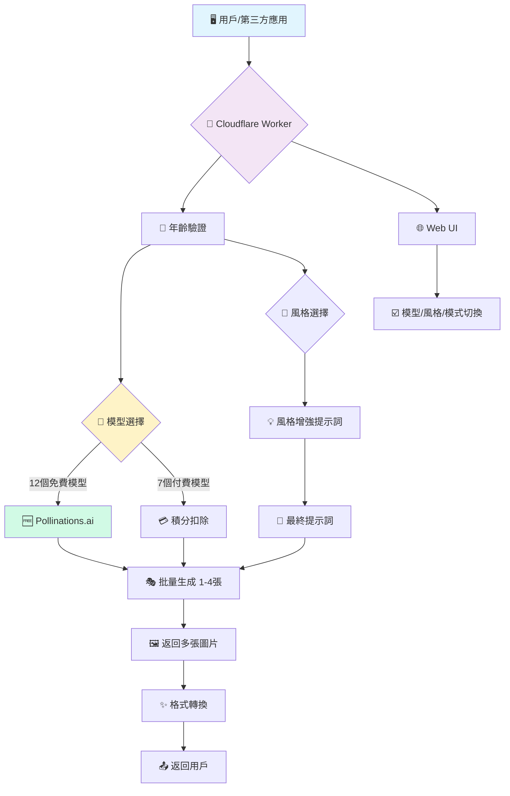

# 🎨 AI Generator Multi-Model (v2.12.0)

<div align="center">


**終極多模型多風格 AI 繪畫 API · 12 免費 + 7 付費 = 19 模型 · 19 藝術風格 · 14,440+ 種組合**

> 🔥 **重大突破**: Pollinations.ai 提供 12 個完全免費的專業級 AI 模型,包括 Flux Pro、Flux 1.1 Pro、Flux Kontext Por 等頂級模型!從基礎到專業,從快速到極致,全部零成本使用!

[](https://deploy.workers.cloudflare.com/?url=https://github.com/kinai9661/fluxai)
[](https://github.com/kinai9661/fluxai/blob/main/TESTING.md)

</div>

---

## ⚠️ 重要聲明

**本項目僅供合法的藝術創作使用。使用者必須:**
- ✅ 年滿 18 歲(或當地法定成年年齡)
- ✅ 遵守當地法律法規
- ✅ 對生成內容負全部責任
- ❌ 禁止生成涉及未成年人、非自願或非法內容

**默認啟用安全模式,確保內容合規。**

---

## ✨ 核心特性

<div align="center">

| 🔥 12個免費模型 | 🎨 19種風格 | 🤖 19+總模型 | 🖼️ 多圖生成 | 🎭 藝術自由 |
|:---:|:---:|:---:|:---:|:---:|
| **Pollinations**<br>含Pro版 | **完整預設**<br>專業增強 | **免費+付費**<br>雙通道 | **批量處理**<br>1-4張 | **雙模式**<br>安全可控 |

</div>

### 🎨 功能亮點

- **🔥 12個Pollinations免費模型**: 包含 Flux Pro、Flux 1.1 Pro、Flux Kontext Por 等專業級模型,完全免費! ⭐ **NEW**
- **🎯 四級模型分類**: 基礎/專業/特化/實驗,清晰組織 ⭐ **NEW**
- **🎨 19種藝術風格**: 日本動漫/漫畫、寫實照片、油畫、水彩、賽博朋克、奇幻、3D渲染等
- **🖼️ 多圖生成**: 支持同時生成 1-4 張圖片,並發處理
- **🎭 藝術創作模式**: 支持合法藝術創作,可關閉內容過濾
- **🛡️ 安全控制**: 年齡驗證 + 雙模式切換 + 詳細警告
- **🔄 自動更新**: 模型列表自動同步最新可用模型
- **⚡️ 一鍵部署**: Cloudflare Workers 零配置部署,5分鐘上線

---

## 🤖 支持的 AI 模型 (19+)

### 🆓 Pollinations 免費模型家族 (12個)

#### 🚀 基礎高速模型 (2個)

| 模型 | 速度 | 質量 | 積分 | 多圖 | NSFW | 描述 |
|------|------|------|------|------|------|------|
| **Pollinations Turbo** | ⭐⭐⭐ 超快 | ⭐⭐ 良好 | 🆓 **0** | 1-4 | ✅ | 超快速基礎模型,適合快速迭代 |
| **Pollinations Flux** | ⭐⭐ 快速 | ⭐⭐⭐ 優秀 | 🆓 **0** | 1-4 | ✅ | 高質量通用模型,平衡速度與品質 |

#### 🌟 專業級模型 (3個) 🔥 **含 Pro 版!**

| 模型 | 速度 | 質量 | 積分 | 多圖 | NSFW | 描述 |
|------|------|------|------|------|------|------|
| **Pollinations Flux Pro ⭐** | ⭐⭐ 中速 | ⭐⭐⭐⭐ 最佳 | 🆓 **0** | 1-4 | ✅ | 專業級Flux Pro,極致細節和質量 |
| **Pollinations Flux 1.1 Pro 🔥** | ⭐⭐ 中速 | ⭐⭐⭐⭐ 最佳 | 🆓 **0** | 1-4 | ✅ | 最新1.1版本,更快更準確 |
| **Pollinations Flux Realism** | ⭐⭐ 中速 | ⭐⭐⭐ 優秀 | 🆓 **0** | 1-4 | ✅ | 寫實風格特化,照片級真實感 |

#### 🎯 特化專用模型 (4個) 🔥 **含 Kontext Por!**

| 模型 | 速度 | 質量 | 積分 | 多圖 | NSFW | 描述 |
|------|------|------|------|------|------|------|
| **Pollinations Flux Anime** | ⭐⭐ 中速 | ⭐⭐⭐ 優秀 | 🆓 **0** | 1-4 | ✅ | 動漫風格特化,完美的二次元 |
| **Pollinations Flux 3D** | ⭐⭐ 中速 | ⭐⭐⭐ 優秀 | 🆓 **0** | 1-4 | ✅ | 3D渲染風格,立體建模效果 |
| **Pollinations Flux Kontext 🎯** | ⭐⭐ 中速 | ⭐⭐⭐ 優秀 | 🆓 **0** | 1-4 | ✅ | 情境理解增強,複雜場景構圖 |
| **Pollinations Kontext Por 🔥** | ⭐⭐ 中速 | ⭐⭐⭐⭐ 最佳 | 🆓 **0** | 1-4 | ✅ | Kontext Por版,藝術創作增強 |

#### ✨ 實驗特效模型 (3個)

| 模型 | 速度 | 質量 | 積分 | 多圖 | NSFW | 描述 |
|------|------|------|------|------|------|------|
| **Pollinations Flux CablyAI** | ⭐⭐ 中速 | ⭐⭐⭐ 優秀 | 🆓 **0** | 1-4 | ✅ | CablyAI增強版,創意構圖優化 |
| **Pollinations Any Dark** | ⭐⭐ 快速 | ⭐⭐ 良好 | 🆓 **0** | 1-4 | ✅ | 暗色調風格,低光環境優化 |
| **Pollinations MJ Style** | ⭐⭐ 中速 | ⭐⭐⭐ 優秀 | 🆓 **0** | 1-4 | ✅ | Midjourney風格模擬,藝術感強 |

### 💎 付費高端模型 (7+)

| 模型 | 提供商 | 速度 | 質量 | 積分 | 多圖 | NSFW |
|------|----------|------|------|------|------|------|
| **Flux Schnell** | Replicate | ⭐⭐⭐ | ⭐⭐ | 1 | 1-4 | ✅ |
| **Flux Dev** | Replicate | ⭐⭐ | ⭐⭐⭐ | 2 | 1-4 | ✅ |
| **Flux Pro** | Replicate | ⭐ | ⭐⭐⭐⭐ | 5 | 1 | ✅ |
| **Flux 1.1 Pro** | Replicate | ⭐ | ⭐⭐⭐⭐ | 6 | 1 | ✅ |
| **SD XL** | Stability | ⭐⭐ | ⭐⭐⭐ | 2 | 1-4 | ✅ |
| **SD 3** | Stability | ⭐⭐ | ⭐⭐⭐ | 3 | 1-4 | ✅ |
| **DALL-E 3** | OpenAI | ⭐⭐ | ⭐⭐⭐ | 4 | 1 | ❌ |

---

## 🎨 支持的藝術風格 (19種)

### 🇯🇵 日本風格系列

| 風格ID | 名稱 | 效果描述 | 適用場景 |
|--------|------|----------|----------|
| `anime` | 日本動漫 | 明亮色彩,賽璐璐陰影,動畫質感 | 動漫角色、場景 |
| `manga` | 日本漫畫 | 黑白線條,網點陰影,細膩線稿 | 漫畫分鏡、人物 |
| `ukiyo-e` | 浮世繪 | 平塗色塊,粗線條,江戶風格 | 日本傳統主題 |

### 📸 寫實系列

| 風格ID | 名稱 | 效果描述 | 適用場景 |
|--------|------|----------|----------|
| `realistic` | 寫實照片 | 8K超高清,專業攝影,自然光影 | 人像、風景攝影 |
| `3d-render` | 3D渲染 | 光線追蹤,平滑表面,建模質感 | 產品設計、角色 |

### 🖼️ 繪畫系列

| 風格ID | 名稱 | 效果描述 | 適用場景 |
|--------|------|----------|----------|
| `oil-painting` | 油畫 | 文藝復興,可見筆觸,畫布質感 | 古典肖像、風景 |
| `watercolor` | 水彩畫 | 柔和邊緣,透明顏料,紙張質感 | 柔和畫作、插畫 |
| `sketch` | 素描 | 鉛筆石墨,手繪陰影,單色調 | 速寫、草圖 |
| `chinese-ink` | 中國水墨 | 流動筆觸,濃淡變化,留白美學 | 山水、花鳥 |
| `impressionism` | 印象派 | 莫內風格,光影強調,鬆散筆觸 | 戶外光影場景 |

### 🌟 風格藝術

| 風格ID | 名稱 | 效果描述 | 適用場景 |
|--------|------|----------|----------|
| `cyberpunk` | 賽博朋克 | 霓虹燈光,未來科技,反烏托邦 | 未來城市、科幻 |
| `fantasy` | 奇幻藝術 | 魔法元素,史詩場景,戲劇光影 | 魔幻世界、英雄 |
| `steampunk` | 蒸汽朋克 | 維多利亞,黃銅齒輪,復古機械 | 工業革命主題 |
| `surreal` | 超現實 | 達利風格,夢境般,扭曲現實 | 抽象藝術、夢境 |

### 🎯 現代風格

| 風格ID | 名稱 | 效果描述 | 適用場景 |
|--------|------|----------|----------|
| `pixel-art` | 像素藝術 | 8bit風格,像素化,復古遊戲 | 復古遊戲、圖標 |
| `comic` | 美式漫畫 | 粗線條,半調網點,動態構圖 | 超級英雄、動作 |
| `minimalist` | 極簡主義 | 簡潔線條,有限配色,負空間 | 現代設計、海報 |
| `art-nouveau` | 新藝術 | 有機形態,流動線條,裝飾元素 | 復古海報、裝飾 |

### 🎭 特殊風格

| 風格ID | 名稱 | 效果 |
|--------|------|------|
| `auto` | 自動 | AI 自動選擇最佳風格 |

---

## 🔥 Pollinations 完整優勢分析

<div align="center">

### 💰 成本對比

| 特性 | Pollinations (12模型) | 傳統 API (7模型) |
|:---:|:---:|:---:|
| **價格** | 🆓 完全免費 | 💳 需要積分 |
| **模型數** | 🔥 **12 個** | 💎 7 個 |
| **Pro級** | ✅ **含 Flux Pro** | ✅ 含 Flux Pro |
| **最新版** | ✅ **含 1.1 Pro** | ✅ 含 1.1 Pro |
| **特化版** | ✅ **Kontext Por** | ❌ 無 |
| **速度** | ⚡ 快速到超快 | ⏱️ 中等 |
| **質量** | ⭐⭐⭐-⭐⭐⭐⭐ | ⭐⭐⭐-⭐⭐⭐⭐ |
| **限制** | ✅ 無限制 | 🚫 積分限制 |
| **多圖** | ✅ 支持 1-4張 | ✅ 支持 |
| **風格** | ✅ 全部19種 | ✅ 全部19種 |
| **NSFW** | ✅ 支持 | ✅ 支持 |

</div>

---

## 🎯 模型選擇推薦指南

<div align="center">

### 🏆 按場景推薦

| 創作場景 | 推薦模型 | 推薦風格 | 成本 | 理由 |
|---------|----------|----------|------|------|
| 🎨 **日常創作** | Pollinations Flux | `auto` | 🆓 免費 | 快速高質量通用 |
| 💎 **專業項目** | Pollinations Flux Pro | `realistic` | 🆓 免費 | Pro級質量免費! |
| 🔥 **極致質量** | Pollinations 1.1 Pro | `realistic` | 🆓 免費 | 最新最強免費! |
| 🎌 **動漫創作** | Pollinations Flux Anime | `anime` | 🆓 免費 | 動漫特化優化 |
| 📸 **寫實人像** | Pollinations Realism | `realistic` | 🆓 免費 | 寫實特化免費 |
| 🎯 **複雜場景** | Pollinations Kontext Por | `fantasy` | 🆓 免費 | 情境理解增強 |
| 🎭 **3D作品** | Pollinations Flux 3D | `3d-render` | 🆓 免費 | 3D特化優化 |
| ⚡ **快速測試** | Pollinations Turbo | `auto` | 🆓 免費 | 超快速迭代 |
| 🌙 **暗黑風格** | Pollinations Any Dark | `cyberpunk` | 🆓 免費 | 暗色調優化 |
| 🎨 **藝術感** | Pollinations MJ Style | `fantasy` | 🆓 免費 | Midjourney風格 |

### 🎭 按需求推薦

| 需求 | 推薦模型 | 原因 |
|------|----------|------|
| 💰 **預算有限** | Pollinations 全系列 | 12個模型全免費 |
| ⚡ **需要快速** | Pollinations Turbo | 超快速生成 |
| 🏆 **追求極致** | Pollinations 1.1 Pro | 最新最強且免費 |
| 🎌 **二次元** | Pollinations Flux Anime | 動漫專用優化 |
| 📸 **寫實照片** | Pollinations Realism | 照片級特化 |
| 🎯 **複雜構圖** | Pollinations Kontext Por | 情境深度理解 |
| 🎨 **批量創作** | Pollinations Flux | 穩定快速 |

</div>

---

## 🏗️ 架構總覽



---

## 🚀 快速開始

### 方案一:一鍵部署(推薦)

<div align="center">

[](https://deploy.workers.cloudflare.com/?url=https://github.com/kinai9661/fluxai)

</div>

**部署步驟:**

1. 點擊上方按鈕 → 登錄 Cloudflare 賬戶
2. 項目命名 → 例如 `my-ai-painter`
3. 配置環境變量:
   - Worker 設置 → 變量
   - 添加 `API_MASTER_KEY` (你的訪問密鑰)
   - 點擊 🔒 加密按鈕
4. 保存部署 → 完成!🎉

---

## 🎮 使用指南

### 1. 🌐 Web UI 使用

訪問: `https://你的項目名.你的子域名.workers.dev`

#### 🎨 風格創作流程

**情境 A: 免費專業級人像**
1. 選擇模型: `Pollinations Flux Pro ⭐` (**免費Pro!**)
2. 選擇風格: `寫實照片`
3. 輸入提示詞: `professional portrait of a woman`
4. 生成數量: `1 張`
5. 點擊生成 → **專業級質量,完全免費!** 🆓

**情境 B: 免費最新版本**
1. 選擇模型: `Pollinations Flux 1.1 Pro 🔥` (**最新!**)
2. 選擇風格: `奇幻藝術`
3. 輸入: `魔法城堡在雲端`
4. 生成 → **最新版本免費體驗!** 🔥

**情境 C: 免費複雜場景**
1. 選擇模型: `Pollinations Kontext Por 🔥` (**情境增強!**)
2. 選擇風格: `賽博朋克`
3. 輸入: `一個女孩在未來城市的咖啡廳看書`
4. 關閉安全模式 (如需要)
5. 生成 → **情境深度理解!** 🎯

**情境 D: 免費動漫創作**
1. 選擇模型: `Pollinations Flux Anime` (**動漫特化!**)
2. 選擇風格: `日本動漫`
3. 輸入: `櫻花樹下的魔法少女`
4. 生成數量: `4 張`
5. 生成 → **動漫專業優化!** 🎌

---

### 2. 🤖 API 調用示例

#### 使用免費 Flux Pro

```bash
# 免費使用 Flux Pro 生成專業級圖片
curl -X POST https://your-worker.workers.dev/v1/images/generations \
  -H "Authorization: Bearer YOUR_KEY" \
  -H "Content-Type: application/json" \
  -d '{
    "model": "pollinations-flux-pro",
    "prompt": "professional portrait photography",
    "style": "realistic",
    "n": 4,
    "aspect_ratio": "1:1"
  }'

# 結果: 4張 Pro 級圖片,完全免費! 🆓
```

#### 使用 Flux 1.1 Pro (最新版)

```bash
# 最新 1.1 Pro 版本
curl -X POST https://your-worker.workers.dev/v1/chat/completions \
  -H "Authorization: Bearer YOUR_KEY" \
  -H "Content-Type: application/json" \
  -d '{
    "model": "pollinations-flux-1.1-pro",
    "messages": [{"role": "user", "content": "a futuristic city"}],
    "style": "cyberpunk",
    "n": 2
  }'

# 結果: 最新版本極致質量! 🔥
```

#### 使用 Flux Kontext Por (情境增強)

```bash
# 使用 Kontext Por 版本理解複雜場景
curl -X POST https://your-worker.workers.dev/v1/images/generations \
  -H "Authorization: Bearer YOUR_KEY" \
  -H "Content-Type: application/json" \
  -d '{
    "model": "pollinations-flux-kontext-por",
    "prompt": "一個女孩在咖啡廳看書,窗外下雨,溫暖燈光",
    "style": "realistic",
    "safe_mode": false,
    "n": 2
  }'

# 結果: 情境深度理解的複雜場景! 🎯
```

#### 使用動漫特化模型

```bash
# 動漫風格專用優化
curl -X POST https://your-worker.workers.dev/v1/images/generations \
  -H "Authorization: Bearer YOUR_KEY" \
  -H "Content-Type: application/json" \
  -d '{
    "model": "pollinations-flux-anime",
    "prompt": "可愛的貓女孩,大眼睛",
    "style": "anime",
    "n": 4,
    "aspect_ratio": "9:16"
  }'

# 結果: 4張專業動漫風格! 🎌
```

#### 批量風格對比

```bash
# 同時測試多個免費專業模型
for model in "pollinations-flux-pro" "pollinations-flux-1.1-pro" "pollinations-flux-kontext-por"
do
  curl -X POST https://your-worker.workers.dev/v1/images/generations \
    -H "Authorization: Bearer YOUR_KEY" \
    -H "Content-Type: application/json" \
    -d "{
      \"model\": \"$model\",
      \"prompt\": \"fantasy warrior\",
      \"style\": \"fantasy\",
      \"n\": 1
    }"
  echo "\n$model 完成!"
done

# 3個專業模型對比,全部免費! 🆓
```

---

## 🎯 可能性計算

<div align="center">

### 🌟 你的創意宇宙

| 維度 | 選項數 | 說明 |
|:---:|:---:|:---|
| 🤖 **AI 模型** | 19 | 12免費+7付費 |
| 🎨 **藝術風格** | 19 | 從動漫到油畫 |
| 📐 **圖片比例** | 5 | 方形到寬屏 |
| 🖼️ **生成數量** | 4 | 單張到批量 |
| 🎭 **內容模式** | 2 | 安全/藝術 |

**基礎組合**: 19 × 19 = **361 種基本可能**

**完整組合**: 19 × 19 × 5 × 4 × 2 = **14,440 種完整組合!** 🚀

**其中完全免費組合**: 12 × 19 × 5 × 4 × 2 = **9,120 種免費組合!** 🆓

</div>

---

## 💡 創意使用範例

### 範例 1: 免費專業人像攝影

```python
import requests

# 使用免費的 Flux Pro 生成專業人像
response = requests.post(
    "https://your-worker.workers.dev/v1/images/generations",
    headers={"Authorization": "Bearer YOUR_KEY"},
    json={
        "model": "pollinations-flux-pro",
        "prompt": "professional headshot, business woman, studio lighting",
        "style": "realistic",
        "n": 4,
        "aspect_ratio": "1:1"
    }
)

print(f"生成了 {len(response.json()['data'])} 張專業級人像!")
print("成本: 完全免費! 🆓")
```

### 範例 2: Kontext Por 情境創作

```javascript
// 使用 Kontext Por 理解複雜場景
const response = await fetch('https://your-worker.workers.dev/v1/images/generations', {
  method: 'POST',
  headers: { 
    'Authorization': 'Bearer YOUR_KEY',
    'Content-Type': 'application/json'
  },
  body: JSON.stringify({
    model: 'pollinations-flux-kontext-por',
    prompt: '一個騎士在森林中遇到神秘生物,月光穿過樹葉',
    style: 'fantasy',
    safe_mode: false,
    n: 2
  })
});

console.log('Kontext Por 完美理解複雜情境!');
console.log('成本: 免費! 🎯');
```

### 範例 3: 動漫批量創作

```bash
# 使用動漫特化模型批量生成
curl -X POST https://your-worker.workers.dev/v1/images/generations \
  -H "Authorization: Bearer YOUR_KEY" \
  -H "Content-Type: application/json" \
  -d '{
    "model": "pollinations-flux-anime",
    "prompt": "magical girl transformation sequence",
    "style": "anime",
    "n": 4,
    "aspect_ratio": "9:16"
  }'

# 4張動漫風格,完全免費! 🎌
```

---

## 🔬 模型深度對比

### 🏆 Pollinations 內部對比

| 模型 | 定位 | 最佳場景 | 特點 |
|:---:|:---:|:---------|:-----|
| **Turbo** | 入門 | 快速測試 | 速度優先 |
| **Flux** | 標準 | 日常創作 | 平衡之選 |
| **Flux Pro** | 專業 | 專業項目 | Pro級質量 |
| **1.1 Pro** | 旗艦 | 極致品質 | 最新最強 |
| **Realism** | 特化 | 寫實照片 | 照片級 |
| **Anime** | 特化 | 二次元 | 動漫專用 |
| **3D** | 特化 | 3D渲染 | 立體感強 |
| **Kontext** | 高級 | 複雜場景 | 情境理解 |
| **Kontext Por** | 旗艦 | 藝術創作 | 情境+藝術 |
| **CablyAI** | 實驗 | 創意構圖 | 創意優化 |
| **Any Dark** | 實驗 | 暗色調 | 低光優化 |
| **MJ Style** | 實驗 | 藝術感 | MJ風格 |

---

## 🧪 測試指南

```bash
# 下載測試腳本
curl -O https://raw.githubusercontent.com/kinai9661/fluxai/main/test-api.py
pip install requests
python3 test-api.py
```

**測試覆蓋:**
- ✅ 12 個 Pollinations 免費模型 ⭐ **NEW**
- ✅ Flux Pro 免費測試 ⭐ **NEW**
- ✅ Kontext Por 免費測試 ⭐ **NEW**
- ✅ 19 種風格測試
- ✅ 付費模型測試
- ✅ 安全/藝術模式
- ✅ 多張圖片生成
- ✅ 風格 + 模型組合

---

## 🌟 項目演進路線

<div align="center">

| 版本 | 狀態 | 核心特性 | 模型數 |
|:---:|:---:|:---|:---:|
| **v2.5** | ✅ | 多圖生成 | 1 |
| **v2.6** | ✅ | 多模型集成 | 4 |
| **v2.7** | ✅ | 藝術創作模式 | 4 |
| **v2.8** | ✅ | Pollinations 免費 | 7 (3免費) |
| **v2.9** | ✅ | 自動更新模型 | 10 (3免費) |
| **v2.10** | ✅ | 19種藝術風格 | 10 (3免費) |
| **v2.11** | ✅ | 擴展免費模型 | 15 (8免費) |
| **v2.12** | 🎯 **當前** | **Flux Pro + Kontext** | **19+ (12免費)** |
| **v3.0** | 🚧 規劃 | 智能容錯 + 動態配置 | 25+ |
| **v4.0** | 🌌 願景 | 多源適配 + 插件化 | 無限 |

</div>

---

## 📝 變更日誌

### v2.12.0 (2025-11-28) 🔥 **最新**
- 🔥 **新增**: Pollinations Flux Pro (免費專業級!)
- 🔥 **新增**: Pollinations Flux 1.1 Pro (最新版本!)
- 🎯 **新增**: Pollinations Flux Kontext (情境理解)
- 🔥 **新增**: Pollinations Flux Kontext Por (藝術增強!)
- 🎌 **新增**: Pollinations Flux Anime (動漫特化)
- 🎭 **新增**: Pollinations Flux 3D (3D渲染)
- ✨ **新增**: 3個實驗模型 (CablyAI/Any Dark/MJ Style)
- 📊 **擴展**: 免費模型從 3 個擴展到 12 個!
- 🎯 **優化**: 四級模型分類 (基礎/專業/特化/實驗)
- 💰 **突破**: 專業級 Pro 模型完全免費化!

### v2.11.0 (2025-11-28)
- 🆓 擴展 Pollinations 模型到 8 個
- 🎨 添加專業和實驗模型分類

### v2.10.0 (2025-11-28)
- 🎨 新增 19種藝術風格預設系統
- 🇯🇵 添加日本動漫、漫畫、浮世繪等風格
- 🖼️ 添加油畫、水彩、素描、水墨等繪畫風格

### v2.9.0 (2025-11-28)
- 🔄 新增自動更新模型列表功能
- 📡 從上游服務動態獲取最新模型

### v2.8.0 (2025-11-28)
- 🆓 新增 Pollinations.ai 免費 API
- 🤖 添加 3 個免費模型

---

## ⚖️ 法律聲明與使用條款

詳見代碼頂部聲明和年齡驗證頁面使用條款。

**簡要:**
- ✅ 僅用於合法藝術創作
- ✅ 用戶負全部責任
- ❌ 禁止非法內容

---

## 🤝 貢獻指南

我們歡迎所有形式的貢獻!無論是代碼改進、文檔完善,還是創意想法。

### 💡 急需貢獻

- 🤖 測試新增的 Pollinations Pro 模型
- 🎨 更多藝術風格預設
- 🌍 多語言支持
- 🧪 測試用例編寫
- 📚 文檔完善

---

## 📞 支持與聯絡

- 🐛 [GitHub Issues](https://github.com/kinai9661/fluxai/issues)
- 📚 [測試指南](https://github.com/kinai9661/fluxai/blob/main/TESTING.md)
- 💬 [Discussions](https://github.com/kinai9661/fluxai/discussions)

---

<div align="center">

## 🎉 開始創造吧!

**12 免費模型 × 19 風格 × 無限創意 = 你的藝術宇宙 🌌**

**從 Turbo 到 Pro,從 Flux 到 Kontext Por,從免費到專業,全在你手中。**

**現在,專業級的 Flux Pro、最新的 1.1 Pro、情境增強的 Kontext Por,全部完全免費!** 🔥

[](https://deploy.workers.cloudflare.com/?url=https://github.com/kinai9661/fluxai)

*星辰大海,代碼為舟,創意作帆,風格為翼。🚀*

---

**Made with ❤️ by AI Enthusiasts · 19 Models · 19 Styles · 14,440+ Combinations · 12 Free Models · Use Responsibly · 18+ Only**

</div>