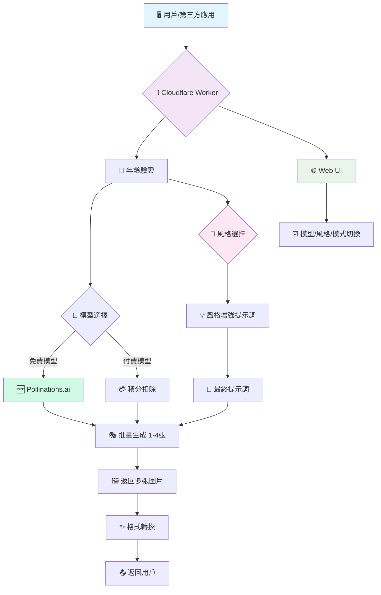

# 🎨 AI Generator Multi-Model (v2.10.0)

<div align="center">


**強大的多模型多風格 AI 繪畫 API · 10 模型 × 19 風格 = 190+ 種組合 · 從免費到專業 · 從安全到自由**

> 🧠 **哲學思考**: 在AI百花齊放的時代,我們不僅融合多個頂級模型,更為每個模型注入豐富的藝術風格。從日本動漫到文藝復興油畫,從賽博朋克到中國水墨,你的創意擁有無限可能的表達方式。

[](https://deploy.workers.cloudflare.com/?url=https://github.com/kinai9661/fluxai)
[](https://github.com/kinai9661/fluxai/blob/main/TESTING.md)

</div>

---

## ⚠️ 重要聲明

**本項目僅供合法的藝術創作使用。使用者必須:**
- ✅ 年滿 18 歲(或當地法定成年年齡)
- ✅ 遵守當地法律法規
- ✅ 對生成內容負全部責任
- ❌ 禁止生成涉及未成年人、非自願或非法內容

**默認啟用安全模式,確保內容合規。**

---

## ✨ 核心特性

<div align="center">

| 🔥 免費模型 | 🎨 豐富風格 | 🤖 多模型 | 🖼️ 多圖生成 | 🎭 藝術自由 |
|:---:|:---:|:---:|:---:|:---:|
| **Pollinations**<br>0積分 | **19種風格**<br>專業預設 | **10個模型**<br>免費+付費 | **批量處理**<br>1-4張 | **雙模式**<br>安全可控 |

</div>

### 🎨 功能亮點

- **🎨 19種藝術風格**: 日本動漫/漫畫、寫實照片、油畫、水彩、賽博朋克、奇幻、3D渲染等 ⭐ **NEW**
- **🆓 Pollinations.ai 免費 API**: 3個完全免費的 AI 模型,無需積分
- **🤖 多模型支持**: 支持 10 個主流 AI 模型,自由選擇
- **🖼️ 多圖生成**: 支持同時生成 1-4 張圖片,並發處理
- **🎭 藝術創作模式**: 支持合法藝術創作,可關閉內容過濾
- **🛡️ 安全控制**: 年齡驗證 + 雙模式切換 + 詳細警告
- **🔄 自動更新**: 模型列表自動同步最新可用模型
- **⚡️ 一鍵部署**: Cloudflare Workers 零配置部署,5分鐘上線

---

## 🤖 支持的 AI 模型

### 🆓 免費模型 (Pollinations.ai)

| 模型 | 速度 | 質量 | 積分 | 多圖 | NSFW | 描述 |
|------|------|------|------|------|------|------|
| **Pollinations Flux** | ⭐⭐⭐ 快速 | ⭐⭐⭐ 優秀 | 🆓 **0** | 1-4 | ✅ | 免費Flux模型,高質量快速生成 |
| **Pollinations Turbo** | ⭐⭐⭐ 超快 | ⭐⭐☆ 良好 | 🆓 **0** | 1-4 | ✅ | 免費超快速模型,適合快速迭代 |
| **Pollinations Flux Realism** | ⭐⭐☆ 中速 | ⭐⭐⭐ 優秀 | 🆓 **0** | 1-4 | ✅ | 免費寫實風格,照片級質量 |

### 💎 付費模型 (Premium)

| 模型 | 提供商 | 速度 | 質量 | 積分 | 多圖 | NSFW |
|------|----------|------|------|------|------|------|
| **Flux Schnell** | Replicate | ⭐⭐⭐ | ⭐⭐☆ | 1 | 1-4 | ✅ |
| **Flux Dev** | Replicate | ⭐⭐☆ | ⭐⭐⭐ | 2 | 1-4 | ✅ |
| **Flux Pro** | Replicate | ⭐☆☆ | ⭐⭐⭐ | 5 | 1 | ✅ |
| **Flux 1.1 Pro** | Replicate | ⭐☆☆ | ⭐⭐⭐ | 6 | 1 | ✅ |
| **SD XL** | Stability | ⭐⭐☆ | ⭐⭐⭐ | 2 | 1-4 | ✅ |
| **SD 3** | Stability | ⭐⭐☆ | ⭐⭐⭐ | 3 | 1-4 | ✅ |
| **DALL-E 3** | OpenAI | ⭐⭐☆ | ⭐⭐⭐ | 4 | 1 | ❌ |

---

## 🎨 支持的藝術風格 (19種)

### 🇯🇵 日本風格系列

| 風格ID | 名稱 | 效果描述 | 適用場景 |
|--------|------|----------|----------|
| `anime` | 日本動漫 | 明亮色彩,賽璐璐陰影,動畫質感 | 動漫角色、場景 |
| `manga` | 日本漫畫 | 黑白線條,網點陰影,細膩線稿 | 漫畫分鏡、人物 |
| `ukiyo-e` | 浮世繪 | 平塗色塊,粗線條,江戶風格 | 日本傳統主題 |

### 📸 寫實系列

| 風格ID | 名稱 | 效果描述 | 適用場景 |
|--------|------|----------|----------|
| `realistic` | 寫實照片 | 8K超高清,專業攝影,自然光影 | 人像、風景攝影 |
| `3d-render` | 3D渲染 | 光線追蹤,平滑表面,建模質感 | 產品設計、角色 |

### 🖼️ 繪畫系列

| 風格ID | 名稱 | 效果描述 | 適用場景 |
|--------|------|----------|----------|
| `oil-painting` | 油畫 | 文藝復興,可見筆觸,畫布質感 | 古典肖像、風景 |
| `watercolor` | 水彩畫 | 柔和邊緣,透明顏料,紙張質感 | 柔和畫作、插畫 |
| `sketch` | 素描 | 鉛筆石墨,手繪陰影,單色調 | 速寫、草圖 |
| `chinese-ink` | 中國水墨 | 流動筆觸,濃淡變化,留白美學 | 山水、花鳥 |
| `impressionism` | 印象派 | 莫內風格,光影強調,鬆散筆觸 | 戶外光影場景 |

### 🌟 風格藝術

| 風格ID | 名稱 | 效果描述 | 適用場景 |
|--------|------|----------|----------|
| `cyberpunk` | 賽博朋克 | 霓虹燈光,未來科技,反烏托邦 | 未來城市、科幻 |
| `fantasy` | 奇幻藝術 | 魔法元素,史詩場景,戲劇光影 | 魔幻世界、英雄 |
| `steampunk` | 蒸汽朋克 | 維多利亞,黃銅齒輪,復古機械 | 工業革命主題 |
| `surreal` | 超現實 | 達利風格,夢境般,扭曲現實 | 抽象藝術、夢境 |

### 🎯 現代風格

| 風格ID | 名稱 | 效果描述 | 適用場景 |
|--------|------|----------|----------|
| `pixel-art` | 像素藝術 | 8bit風格,像素化,復古遊戲 | 復古遊戲、圖標 |
| `comic` | 美式漫畫 | 粗線條,半調網點,動態構圖 | 超級英雄、動作 |
| `minimalist` | 極簡主義 | 簡潔線條,有限配色,負空間 | 現代設計、海報 |
| `art-nouveau` | 新藝術 | 有機形態,流動線條,裝飾元素 | 復古海報、裝飾 |

### 🎭 特殊風格

| 風格ID | 名稱 | 效果 |
|--------|------|------|
| `auto` | 自動 | AI 自動選擇最佳風格 |

---

## 🎯 風格 + 模型推薦搭配

<div align="center">

| 創作目標 | 推薦模型 | 推薦風格 | 成本 | 理由 |
|---------|----------|----------|------|------|
| 🎌 **動漫角色** | Pollinations Flux | `anime` | 🆓 免費 | 色彩鮮艷,適合動漫 |
| 📖 **漫畫分鏡** | Pollinations Turbo | `manga` | 🆓 免費 | 超快速,黑白處理好 |
| 📸 **人像攝影** | Flux Pro | `realistic` | 💎 5積分 | 最高質量寫實效果 |
| 🌅 **風景照片** | Pollinations Realism | `realistic` | 🆓 免費 | 專門優化寫實風格 |
| 🤖 **賽博朋克** | Flux Dev | `cyberpunk` | 💎 2積分 | 高質量科幻渲染 |
| ✨ **奇幻場景** | Flux 1.1 Pro | `fantasy` | 💎 6積分 | 最新模型,史詩感 |
| 🖼️ **古典油畫** | SD XL | `oil-painting` | 💎 2積分 | 適合古典繪畫 |
| 🌊 **中國山水** | Pollinations Flux | `chinese-ink` | 🆓 免費 | 免費東方美學 |
| 🌸 **浮世繪** | Pollinations Flux | `ukiyo-e` | 🆓 免費 | 平塗風格表現好 |
| 💧 **水彩插畫** | SD 3 | `watercolor` | 💎 3積分 | 柔和漸變處理 |
| 🕹️ **像素遊戲** | Pollinations Turbo | `pixel-art` | 🆓 免費 | 快速像素化 |
| 🦸 **超級英雄** | Flux Dev | `comic` | 💎 2積分 | 動態構圖強 |

</div>

---

## 🔥 Pollinations.ai 優勢

<div align="center">

| 特性 | Pollinations | 傳統 API |
|:---:|:---:|:---:|
| **價格** | 🆓 完全免費 | 💳 需要積分 |
| **速度** | ⚡ 快速到超快 | ⏱️ 中等 |
| **質量** | ⭐⭐⭐ 優秀 | ⭐⭐⭐ 優秀-最佳 |
| **限制** | ✅ 無限制 | 🚫 積分限制 |
| **多圖** | ✅ 支持 1-4張 | ✅ 支持 |
| **風格** | ✅ 全部19種 | ✅ 全部19種 |
| **NSFW** | ✅ 支持 | ✅ 支持 |

</div>

---

## 🏛️ 架構總覽



---

## 🚀 快速開始

### 方案一:一鍵部署(推薦)

<div align="center">

[](https://deploy.workers.cloudflare.com/?url=https://github.com/kinai9661/fluxai)

</div>

**部署步驟:**

1. 點擊上方按鈕 → 登錄 Cloudflare 賬戶
2. 項目命名 → 例如 `my-ai-painter`
3. 配置環境變量:
   - Worker 設置 → 變量
   - 添加 `API_MASTER_KEY` (你的訪問密鑰)
   - 點擊 🔒 加密按鈕
4. 保存部署 → 完成!🎉

---

## 🎮 使用指南

### 1. 🌐 Web UI 使用

訪問: `https://你的項目名.你的子域名.workers.dev`

#### 🎨 風格創作流程

**情境 A: 創作日本動漫角色**
1. 選擇模型: `Pollinations Flux` (免費)
2. 選擇風格: `日本動漫`
3. 輸入提示詞: `一個可愛的魔法少女`
4. 生成數量: `4 張`
5. 點擊生成 → **完全免費!** 🆓

**情境 B: 專業寫實人像**
1. 選擇模型: `Flux Pro` (最高質量)
2. 選擇風格: `寫實照片`
3. 取消安全模式 (如需要)
4. 輸入: `年輕女性的肖像`
5. 點擊生成 → 消耗 5 積分 💎

**情境 C: 賽博朋克城市**
1. 選擇模型: `Flux Dev`
2. 選擇風格: `賽博朋克`
3. 圖片比例: `16:9` (橫屏)
4. 輸入: `未來都市的夜景`
5. 生成 → 霓虹科幻風格 🌃

**情境 D: 中國水墨畫**
1. 選擇模型: `Pollinations Flux` (免費)
2. 選擇風格: `中國水墨`
3. 輸入: `山水風景`
4. 生成 → 傳統水墨意境 🖌️

---

### 2. 🤖 API 調用示例

#### 基礎風格使用

```bash
# 日本動漫風格 - 免費生成 4 張
curl -X POST https://your-worker.workers.dev/v1/images/generations \
  -H "Authorization: Bearer YOUR_KEY" \
  -H "Content-Type: application/json" \
  -d '{
    "model": "pollinations-flux",
    "prompt": "一個可愛的貓女孩",
    "style": "anime",
    "n": 4
  }'

# 寫實照片風格
curl -X POST https://your-worker.workers.dev/v1/chat/completions \
  -H "Authorization: Bearer YOUR_KEY" \
  -H "Content-Type: application/json" \
  -d '{
    "model": "pollinations-flux-realism",
    "messages": [{"role": "user", "content": "美麗的風景"}],
    "style": "realistic",
    "aspect_ratio": "16:9"
  }'
```

#### 進階風格組合

```bash
# 賽博朋克 + 藝術模式
curl -X POST https://your-worker.workers.dev/v1/images/generations \
  -H "Authorization: Bearer YOUR_KEY" \
  -H "Content-Type: application/json" \
  -d '{
    "model": "flux-dev",
    "prompt": "cyberpunk street scene",
    "style": "cyberpunk",
    "safe_mode": false,
    "n": 2
  }'

# 油畫風格高質量
curl -X POST https://your-worker.workers.dev/v1/images/generations \
  -H "Authorization: Bearer YOUR_KEY" \
  -H "Content-Type: application/json" \
  -d '{
    "model": "flux-pro",
    "prompt": "portrait of a noble woman",
    "style": "oil-painting"
  }'

# 日本漫畫風格
curl -X POST https://your-worker.workers.dev/v1/images/generations \
  -H "Authorization: Bearer YOUR_KEY" \
  -H "Content-Type: application/json" \
  -d '{
    "model": "pollinations-turbo",
    "prompt": "武士決鬥場景",
    "style": "manga",
    "n": 3
  }'
```

#### 查詢可用風格

```bash
# 獲取所有風格列表
curl https://your-worker.workers.dev/v1/styles
```

**返回示例:**
```json
{
  "object": "list",
  "data": [
    {
      "id": "anime",
      "name": "日本動漫",
      "description": "日本動畫風格,明亮色彩",
      "prompt_enhancement": "anime style, vibrant colors, manga art..."
    }
  ]
}
```

---

## 🎨 風格效果預覽

### 同一提示詞,不同風格對比

**原始提示詞**: `"a girl in the garden"`

| 風格 | 增強後的提示詞 | 視覺效果 |
|------|---------------|----------|
| `auto` | a girl in the garden | AI 自動選擇 |
| `anime` | a girl in the garden, anime style, vibrant colors, manga art | 🎌 明亮動漫風 |
| `manga` | a girl in the garden, manga style, black and white, ink drawing | 📖 黑白漫畫風 |
| `realistic` | a girl in the garden, photorealistic, highly detailed, 8k uhd | 📸 照片級寫實 |
| `oil-painting` | a girl in the garden, oil painting, classical art, brushstrokes | 🖼️ 古典油畫 |
| `watercolor` | a girl in the garden, watercolor painting, soft edges | 💧 柔和水彩 |
| `cyberpunk` | a girl in the garden, cyberpunk style, neon lights, futuristic | 🤖 未來科幻 |

---

## 💡 創意使用範例

### 範例 1: 動漫風格批量創作

```python
import requests

# 免費生成 4 張動漫風格圖片
response = requests.post(
    "https://your-worker.workers.dev/v1/images/generations",
    headers={"Authorization": "Bearer YOUR_KEY"},
    json={
        "model": "pollinations-flux",
        "prompt": "櫻花樹下的少女,春天,溫暖陽光",
        "style": "anime",
        "n": 4,
        "aspect_ratio": "9:16"
    }
)

print(f"生成了 {len(response.json()['data'])} 張動漫圖片!")
# 完全免費! 🆓
```

### 範例 2: 多風格對比

```javascript
const styles = ['anime', 'manga', 'realistic', 'oil-painting'];
const prompt = "一個武士";

for (const style of styles) {
  const response = await fetch('https://your-worker.workers.dev/v1/images/generations', {
    method: 'POST',
    headers: { 
      'Authorization': 'Bearer YOUR_KEY',
      'Content-Type': 'application/json'
    },
    body: JSON.stringify({
      model: 'pollinations-flux',
      prompt: prompt,
      style: style,
      n: 1
    })
  });
  
  console.log(`${style} 風格生成完成!`);
}
// 生成 4 種不同風格的武士圖片,全部免費!
```

### 範例 3: 專業項目製作

```bash
# 高端寫實人像 - Flux Pro + 寫實風格
curl -X POST https://your-worker.workers.dev/v1/images/generations \
  -H "Authorization: Bearer YOUR_KEY" \
  -H "Content-Type: application/json" \
  -d '{
    "model": "flux-pro",
    "prompt": "professional headshot of a business woman, studio lighting",
    "style": "realistic",
    "safe_mode": false,
    "size": "1024x1024"
  }'
# 專業級質量,消耗 5 積分
```

---

## 🧪 測試指南

```bash
# 下載測試腳本
curl -O https://raw.githubusercontent.com/kinai9661/fluxai/main/test-api.py
pip install requests
python3 test-api.py
```

**測試覆蓋:**
- ✅ 19 種風格測試 ⭐ **NEW**
- ✅ Pollinations 免費模型
- ✅ 付費模型測試
- ✅ 安全/藝術模式
- ✅ 多張圖片生成
- ✅ 風格 + 模型組合

---

## 🎯 可能性計算

<div align="center">

### 🌟 你的創意空間

| 維度 | 選項數 | 說明 |
|:---:|:---:|:---|
| 🤖 **AI 模型** | 10 | 免費+付費選擇 |
| 🎨 **藝術風格** | 19 | 從動漫到油畫 |
| 📊 **圖片比例** | 5 | 方形到寬屏 |
| 🖼️ **生成數量** | 4 | 單張到批量 |
| 🎭 **內容模式** | 2 | 安全/藝術 |

**基礎組合**: 10 × 19 × 5 = **950 種可能性**

**完整組合**: 10 × 19 × 5 × 4 × 2 = **7,600 種組合!** 🚀

</div>

---

## 🔧 技術深度解析

### 風格智能增強系統

```javascript
// 用戶輸入
{
  "prompt": "一個女孩",
  "style": "anime"
}

// ⬇️ 系統自動增強

finalPrompt = "一個女孩, anime style, vibrant colors, manga art, Japanese animation, cel shading"

// ⬇️ 發送給 AI 模型

// 🎨 輸出: 專業動漫風格圖片
```

### 核心模塊

| 模塊 | 功能 | 難度 | 新功能 |
|------|------|------|--------|
| **🎨 風格系統** | 19種預設 + 智能增強 | ⭐⭐⭐ | ⭐ v2.10 |
| **🔄 自動同步** | 動態更新模型列表 | ⭐⭐⭐ | ⭐ v2.9 |
| **🆓 免費集成** | Pollinations API | ⭐⭐☆ | ⭐ v2.8 |
| **🛡️ 安全系統** | 年齡驗證 + 模式控制 | ⭐⭐⭐ | ⭐ v2.7 |
| **🔄 批量生成** | 並發處理多張 | ⭐⭐⭐ | ⭐ v2.5 |

---

## 🌟 項目演進路線

<div align="center">

| 版本 | 狀態 | 核心特性 | 技術突破 |
|:---:|:---:|:---|:---|
| **v2.5** | ✅ | 多圖生成 | 並發處理 |
| **v2.6** | ✅ | 多模型集成 | 智能路由 |
| **v2.7** | ✅ | 藝術創作模式 | 安全可控 |
| **v2.8** | ✅ | Pollinations 免費 | 雙 Provider |
| **v2.9** | ✅ | 自動更新模型 | 動態同步 |
| **v2.10** | 🎯 **當前** | **19種藝術風格** | 風格大師 |
| **v3.0** | 🚧 規劃 | 智能容錯 + 動態配置 | 健壯性 |
| **v4.0** | 🌌 願景 | 多源適配 + 插件化 | 生態擴展 |

</div>

---

## 📝 變更日誌

### v2.10.0 (2025-11-28) ⭐ **最新**
- 🎨 **新增**: 19種藝術風格預設系統
- 🇯🇵 **新增**: 日本動漫、漫畫、浮世繪風格
- 🖼️ **新增**: 油畫、水彩、素描、水墨等繪畫風格
- 🤖 **新增**: 賽博朋克、奇幻、蒸汽朋克等風格藝術
- 🎯 **新增**: 像素藝術、極簡、超現實等現代風格
- 💡 **增強**: 風格智能融合到提示詞
- 🌐 **增強**: Web UI 風格選擇器和提示
- 📊 **新增**: `/v1/styles` API 端點

### v2.9.0 (2025-11-28)
- 🔄 新增自動更新模型列表功能
- 📡 從上游服務動態獲取最新模型
- 💾 實現模型緩存機制(1小時TTL)

### v2.8.0 (2025-11-28)
- 🆓 新增 Pollinations.ai 免費 API
- 🤖 添加 3 個免費模型
- 🔀 雙 provider 智能路由

### v2.7.0 (2025-11-28)
- 🎨 新增藝術創作模式
- 🔐 年齡驗證機制
- 🛡️ 安全模式切換

---

## ⚖️ 法律聲明與使用條款

詳見代碼頂部聲明和年齡驗證頁面使用條款。

**簡要:**
- ✅ 僅用於合法藝術創作
- ✅ 用戶負全部責任
- ❌ 禁止非法內容

---

## 🤝 貢獻指南

我們歡迎所有形式的貢獻!無論是代碼改進、文檔完善,還是創意想法。

### 💡 急需貢獻

- 🎨 更多藝術風格預設
- 🌍 多語言支持
- 🧪 測試用例編寫
- 📚 文檔完善
- 🤖 更多模型集成

---

## 📞 支持與聯絡

- 🐛 [GitHub Issues](https://github.com/kinai9661/fluxai/issues)
- 📚 [測試指南](https://github.com/kinai9661/fluxai/blob/main/TESTING.md)
- 💬 [Discussions](https://github.com/kinai9661/fluxai/discussions)

---

<div align="center">

## 🎉 開始創造吧!

**10 模型 × 19 風格 × 無限創意 = 你的藝術宇宙 🌌**

**從免費到專業,從安全到自由,從動漫到油畫,你的想像無限可能。**

[](https://deploy.workers.cloudflare.com/?url=https://github.com/kinai9661/fluxai)

*星辰大海,代碼為舟,創意作帆,風格為翼。🚀*

---

**Made with ❤️ by AI Enthusiasts · 10 Models · 19 Styles · 7,600+ Combinations · Use Responsibly · 18+ Only**

</div>