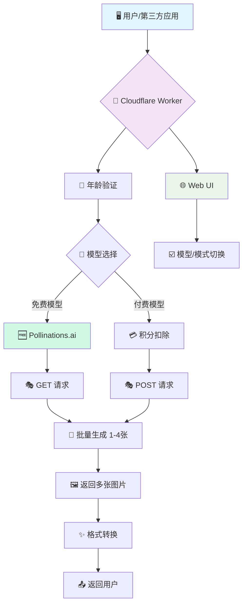

# 🎨 AI Generator Multi-Model (v2.8.0)

<div align="center">


**强大的多模型 AI 绘画 API · 支持 Pollinations/Flux/SD/DALL-E · 免费+付费双选择 · 艺术创作自由**

> 🧠 **哲学思考**: 在AI百花齐放的时代,我们融合免费与付费、安全与自由,为艺术创作者提供最大的选择空间。从 Pollinations 的完全免费到 Flux Pro 的极致质量,你的创意无限可能。

[](https://deploy.workers.cloudflare.com/?url=https://github.com/kinai9661/fluxai)
[](https://github.com/kinai9661/fluxai/blob/main/TESTING.md)

</div>

---

## ⚠️ 重要声明

**本项目仅供合法的艺术创作使用。使用者必须:**
- ✅ 年满 18 岁(或当地法定成年年龄)
- ✅ 遵守当地法律法规
- ✅ 对生成内容负全部责任
- ❌ 禁止生成涉及未成年人、非自愿或非法内容

**默认启用安全模式,确保内容合规。**

---

## ✨ 核心特性

<div align="center">

| 🔥 免费模型 | 🚀 极致性能 | 🤖 多模型 | 🖼️ 多图生成 | 🎨 艺术自由 |
|:---:|:---:|:---:|:---:|:---:|
| **Pollinations**<br>0积分 | **单文件**<br>极致精简 | **10个模型**<br>免费+付费 | **批量处理**<br>1-4张 | **双模式**<br>安全可控 |

</div>

### 🎨 功能亮点

- **🆓 Pollinations.ai 免费 API**: 3个完全免费的 AI 模型,无需积分 ⭐ **NEW**
  - Pollinations Flux (高质量快速)
  - Pollinations Turbo (超快速)
  - Pollinations Flux Realism (写实风格)
- **🤖 多模型支持**: 支持 10 个主流 AI 模型,自由选择
  - 免费: Pollinations 系列 (3个)
  - 付费: Flux/SD/DALL-E (7个)
- **🖼️ 多图生成**: 支持同时生成 1-4 张图片,并发处理
- **🎨 艺术创作模式**: 支持合法艺术创作,可关闭内容过滤
- **🛡️ 安全控制**: 年龄验证 + 双模式切换 + 详细警告
- **🎯 智能路由**: 根据模型自动路由到对应 provider
- **⚡️ 一键部署**: Cloudflare Workers 零配置部署,5分钟上线
- **💸 成本优化**: 免费模型为主,付费模型可选

---

## 🤖 支持的 AI 模型

### 🆓 免费模型 (Pollinations.ai)

| 模型 | 速度 | 质量 | 积分 | 多图 | NSFW | 描述 |
|------|------|------|------|------|------|------|
| **Pollinations Flux** | ⭐⭐⭐ 快速 | ⭐⭐⭐ 优秀 | 🆓 **0** | 1-4 | ✅ | 免费 Flux 模型,高质量快速生成 |
| **Pollinations Turbo** | ⭐⭐⭐ 超快 | ⭐⭐☆ 良好 | 🆓 **0** | 1-4 | ✅ | 免费超快速模型,适合快速迭代 |
| **Pollinations Flux Realism** | ⭐⭐☆ 中速 | ⭐⭐⭐ 优秀 | 🆓 **0** | 1-4 | ✅ | 免费写实风格,照片级质量 |

### 💎 付费模型 (Premium)

| 模型 | 提供商 | 速度 | 质量 | 积分 | 多图 | NSFW |
|------|----------|------|------|------|------|------|
| **Flux Schnell** | Replicate | ⭐⭐⭐ | ⭐⭐☆ | 1 | 1-4 | ✅ |
| **Flux Dev** | Replicate | ⭐⭐☆ | ⭐⭐⭐ | 2 | 1-4 | ✅ |
| **Flux Pro** | Replicate | ⭐☆☆ | ⭐⭐⭐ | 5 | 1 | ✅ |
| **Flux 1.1 Pro** | Replicate | ⭐☆☆ | ⭐⭐⭐ | 6 | 1 | ✅ |
| **SD XL** | Stability | ⭐⭐☆ | ⭐⭐⭐ | 2 | 1-4 | ✅ |
| **SD 3** | Stability | ⭐⭐☆ | ⭐⭐⭐ | 3 | 1-4 | ✅ |
| **DALL-E 3** | OpenAI | ⭐⭐☆ | ⭐⭐⭐ | 4 | 1 | ❌ |

---

## 🔥 Pollinations.ai 优势

<div align="center">

| 特性 | Pollinations | 传统 API |
|:---:|:---:|:---:|
| **价格** | 🆓 完全免费 | 💳 需要积分 |
| **速度** | ⚡ 快速到超快 | ⏱️ 中等 |
| **质量** | ⭐⭐⭐ 优秀 | ⭐⭐⭐ 优秀-最佳 |
| **限制** | ✅ 无限制 | 🚫 积分限制 |
| **多图** | ✅ 支持 1-4张 | ✅ 支持 |
| **NSFW** | ✅ 支持 | ✅ 支持 |

</div>

**💡 推荐使用场景:**
- 🆓 **日常创作**: 使用 Pollinations 免费模型
- 💎 **专业项目**: 使用 Flux Pro/1.1 Pro 极致质量
- ⚡ **快速迭代**: 使用 Pollinations Turbo 超快速
- 📸 **写实风格**: 使用 Pollinations Flux Realism

---

## 🏛️ 架构总览



---

## 🚀 快速开始

### 方案一:一键部署(推荐)

<div align="center">

[](https://deploy.workers.cloudflare.com/?url=https://github.com/kinai9661/fluxai)

</div>

**部署步骤:**

1. 点击上方按钮 → 登录 Cloudflare 账户
2. 项目命名 → 例如 `my-ai-painter`
3. 配置环境变量 (Worker 设置 → 变量):
   - 添加 `API_MASTER_KEY` (你的访问密钥)
   - 点击 🔒 加密按钮
4. 保存部署 → 完成!🎉

---

## 🎮 使用指南

### 1. 🌐 Web UI 使用

访问: `https://你的项目名.你的子域名.workers.dev`

#### 首次使用流程

1. **年龄验证** → 确认年满 18 岁
2. **选择模型** → 推荐先使用免费模型
3. **设置参数** → 数量、比例、安全模式
4. **开始创作** → 输入提示词生成

#### 📚 使用示例

**方案A: 使用免费模型(推荐)**
1. 选择模型: `Pollinations Flux`
2. 生成数量: `4 张`
3. 提示词: `a beautiful sunset over mountains`
4. 点击生成 → **完全免费!** 🆓

**方案B: 使用高端模型**
1. 选择模型: `Flux Pro`
2. 提示词: `masterpiece quality portrait`
3. 点击生成 → 消耗 5 积分 💳

**方案C: 艺术创作模式**
1. 选择支持 NSFW 的模型
2. 取消勾选 `🛡️ 安全模式`
3. 输入艺术创作提示词
4. 开始生成

---

### 2. 🤖 API 调用示例

#### 使用 Pollinations 免费模型

```bash
# 免费生成 4 张图片
curl -X POST https://your-worker.workers.dev/v1/chat/completions \
  -H "Authorization: Bearer YOUR_KEY" \
  -H "Content-Type: application/json" \
  -d '{
    "model": "pollinations-flux",
    "messages": [{"role": "user", "content": "cyberpunk city at night"}],
    "n": 4,
    "aspect_ratio": "16:9"
  }'

# 超快速生成
curl -X POST https://your-worker.workers.dev/v1/images/generations \
  -H "Authorization: Bearer YOUR_KEY" \
  -H "Content-Type: application/json" \
  -d '{
    "model": "pollinations-turbo",
    "prompt": "fantasy dragon",
    "n": 2
  }'

# 写实风格
curl -X POST https://your-worker.workers.dev/v1/images/generations \
  -H "Authorization: Bearer YOUR_KEY" \
  -H "Content-Type: application/json" \
  -d '{
    "model": "pollinations-flux-realism",
    "prompt": "portrait of a woman",
    "n": 1
  }'
```

#### 使用付费模型

```bash
# Flux Pro - 最高质量
curl -X POST https://your-worker.workers.dev/v1/chat/completions \
  -H "Authorization: Bearer YOUR_KEY" \
  -H "Content-Type: application/json" \
  -d '{
    "model": "flux-pro",
    "messages": [{"role": "user", "content": "masterpiece artwork"}]
  }'
```

#### 艺术创作模式

```bash
# 关闭安全模式(仅支持 NSFW 的模型)
curl -X POST https://your-worker.workers.dev/v1/images/generations \
  -H "Authorization: Bearer YOUR_KEY" \
  -H "Content-Type: application/json" \
  -d '{
    "model": "pollinations-flux",
    "prompt": "artistic figure study",
    "safe_mode": false,
    "n": 2
  }'
```

#### 查询模型列表

```bash
curl https://your-worker.workers.dev/v1/models
```

---

## 🔧 技术深度解析

### 双 Provider 智能路由

```javascript
// 根据 provider 自动选择生成方法
if (modelConfig.provider === "pollinations") {
    // Pollinations: 简单的 GET 请求,完全免费
    imageUrl = `https://image.pollinations.ai/prompt/${prompt}?model=flux&width=1024&height=1024`;
} else {
    // 付费服务: POST + FormData + 积分扣除
    await deductCredits();
    imageUrl = await fetchFromUpstream();
}
```

### 核心模块

| 模块 | 功能 | 难度 |
|------|------|------|
| **🆓 Pollinations 集成** | 免费 API 调用 | ⭐⭐☆ |
| **🔀 智能路由** | 双 provider 自动切换 | ⭐⭐⭐ |
| **🔐 安全系统** | 年龄验证 + 模式控制 | ⭐⭐⭐ |
| **🔄 批量生成** | 并发处理多张 | ⭐⭐⭐ |

---

## 🧪 测试指南

```bash
# 下载测试脚本
curl -O https://raw.githubusercontent.com/kinai9661/fluxai/main/test-api.py
pip install requests
python3 test-api.py
```

**测试覆盖:**
- ✅ Pollinations 免费模型测试 ⭐ **NEW**
- ✅ 付费模型测试
- ✅ 安全/艺术模式测试
- ✅ 多张图片生成

---

## 🌟 项目演进路线

| 版本 | 状态 | 核心特性 |
|:---:|:---:|:---|
| **v2.6** | ✅ | 多模型集成 |
| **v2.7** | ✅ | 艺术创作模式 |
| **v2.8** | 🎯 **当前** | **Pollinations 免费 API** |
| **v3.0** | 🚧 规划 | 智能容错 + 动态配置 |

---

## 📝 变更日志

### v2.8.0 (2025-11-28) ⭐ **最新**
- 🆓 **新增**: Pollinations.ai 免费 API 集成
- 🤖 **新增**: 3 个 Pollinations 模型 (Flux, Turbo, Flux Realism)
- 🔀 **增强**: 双 provider 智能路由系统
- 💸 **优化**: 免费模型无需积分扣除
- 🌐 **优化**: Web UI 按类型分组显示模型
- 📊 **增强**: 实时显示模型成本信息

### v2.7.0 (2025-11-28)
- 🎨 新增艺术创作模式
- 🔐 年龄验证机制
- 🛡️ 安全模式切换

---

## ⚖️ 法律声明

详见代码顶部声明和年龄验证页面使用条款。

**简要:**
- ✅ 仅用于合法艺术创作
- ✅ 用户负全部责任
- ❌ 禁止非法内容

---

## 📞 支持与联系

- 🐛 [GitHub Issues](https://github.com/kinai9661/fluxai/issues)
- 📚 [测试指南](https://github.com/kinai9661/fluxai/blob/main/TESTING.md)
- 💬 [Discussions](https://github.com/kinai9661/fluxai/discussions)

---

<div align="center">

## 🎉 开始创造吧!

**从免费到高端,从安全到自由,你的创意无限可能。**

[](https://deploy.workers.cloudflare.com/?url=https://github.com/kinai9661/fluxai)

*星辰大海,代码为舟,创意作帆。🚀*

---

**Made with ❤️ by AI Enthusiasts · Free & Premium Options · Use Responsibly · 18+ Only**

</div>